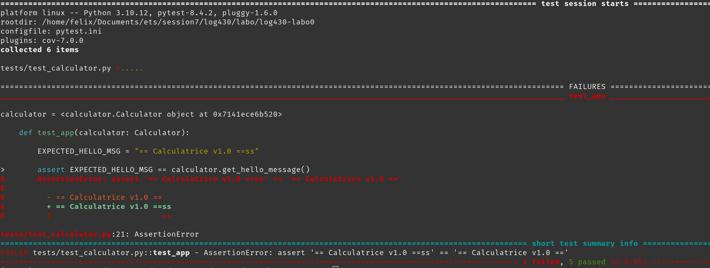
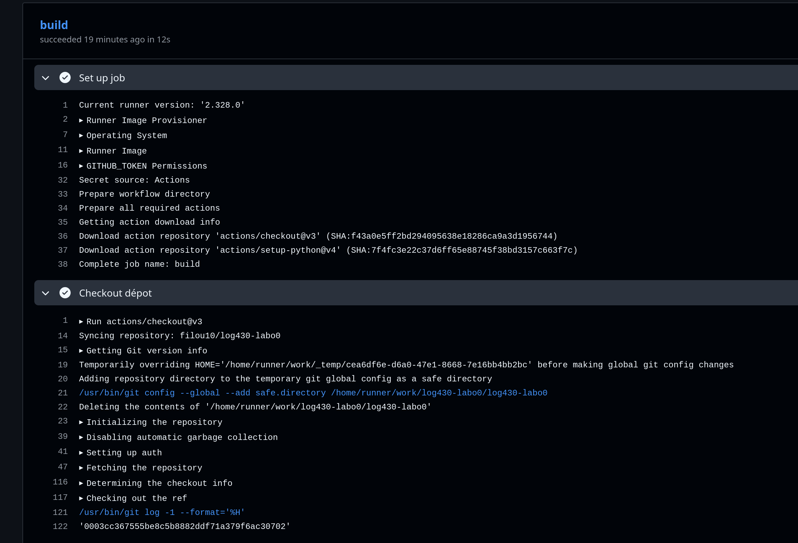
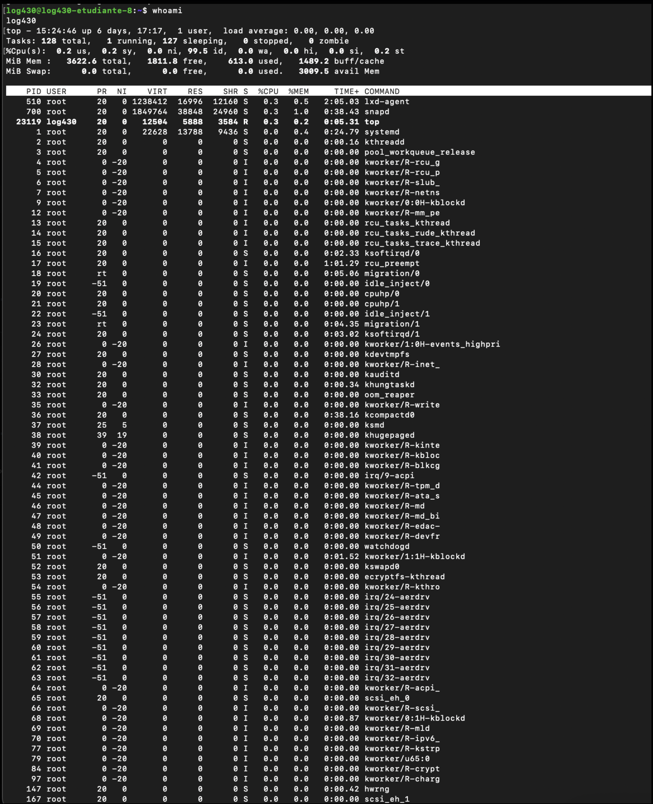

# LOG430 - A25 - labo0

Par Felix-Antoine Legault

## Question 1

Si l’un des tests échoue à cause d’un bug, comment pytest signale-t-il l’erreur et aide-t-il à la localiser ? Rédigez un test qui provoque volontairement une erreur, puis montrez la sortie du terminal obtenue.

Lorsqu'un test échoue dû à un bug, pytest va signaler l'erreur en affichant un F rouge à côté du fichier où se trouve le test. De plus, il y aura une boîte dans le terminal nommée `FAILURES` qui montrera le assert qui a échoué dans l'exécution du test. Il y aura également un chemin du fichier et la ligne qui échoue dans le test. Par exemple, dans le scénario que j'ai monté dans la capture d'écran plus bas, on peut voir que le test a échoué dans le fichier `tests/test_calculator.py` à la ligne 21.

## Question 2

Que fait GitLab pendant les étapes de « setup » et « checkout » ? Veuillez inclure la sortie du terminal Gitlab CI dans votre réponse.

Setup est exécuté par GitHub comme tâche initiale pour préparer l'environnement qui sera utilisé pour effectuer les prochaines étapes dans le pipeline. Par exemple, les actions telles que `checkout@v3` et `setup-python@v4` qui sont utilisées seront téléchargées à cette étape.
L'étape checkout est exécutée pour cloner le dépôt et avoir le projet prêt à être utilisé pour les prochaines étapes comme celle des tests.

## Question 3

Quel approache et quelles commandes avez-vous exécutées pour automatiser le déploiement continu de l'application dans la machine virtuelle ? Veuillez inclure les sorties du terminal et les scripts bash dans votre réponse.

## Question 4

Quel type d'informations pouvez-vous obtenir via la commande « top » ? Veuillez inclure la sortie du terminal dans votre réponse.

Cette commande permet de regarder en temps réel l’utilisation des ressources du système. On peut voir les détails des différents processus actifs.

